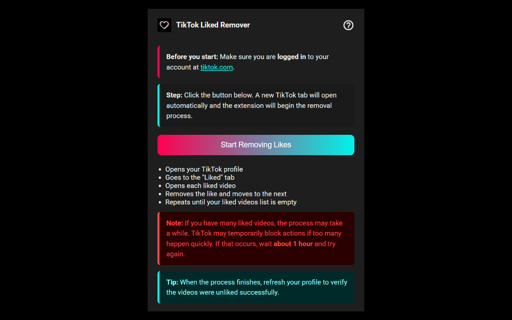

# TikTok All Liked Videos Remover

Remove all your liked videos on TikTok automatically with a single action.

---

## GitAds Sponsored

---

## Features

- Opens your TikTok profile in a new tab automatically  
- Uses the same authenticated TikTok web APIs as the site to list and remove liked videos  
- In-page control panel on TikTok with:
  - Live status and basic statistics (pages, removed, listed, failures)
  - Pause / Resume
  - Downloadable report (JSON or CSV) with removed and failed items  
- Configurable delay between removals (1–10 seconds, random range or fixed set)  
- Optional keyword filter to only remove likes that match certain terms

---

## Installation

### From Chrome Web Store

[Install from Chrome Web Store](https://chromewebstore.google.com/detail/tiktok-all-liked-videos-r/eafmacjdgennnmhagdkdckgjokmnllci)

### Manual installation (for developers)

1. Clone this repository or download the source code.
2. Go to `chrome://extensions` in Google Chrome.
3. Enable **Developer mode** (top right toggle).
4. Click **"Load unpacked"** and select the project folder.

---

## How to use

1. Make sure you are logged in to your TikTok account at [tiktok.com](https://tiktok.com).
2. Click the extension icon in the Chrome toolbar.
3. Configure options in the popup:
   - Whether to filter by keywords or remove all likes
   - Interval mode (random range or fixed set of seconds between removals)
   - Pause between pages and report format (JSON or CSV)
4. Click **Start Removing Likes**.
5. A TikTok tab will open automatically. The in-page panel will appear near the top-right:
   - Shows current status (preparing, listing, removing, between pages, done)
   - You can pause or resume the process
   - You can download a report of removed and failed items at any time once there is data
6. Keep the tab open until the process finishes. Do not close it during the operation.

---

## Behavior details

- When you are not logged in and TikTok redirects `/profile` to `/foryou`, the panel:
  - Detects that you are not logged in.
  - Shows a clear message explaining that you must sign in and start again.
  - Marks the process as paused and disables the pause/resume button.
- When the extension cannot identify your account (no valid session data found), it shows a similar error message and stops safely.
- When removing likes:
  - Only items that match your keyword filter (if enabled) are removed.
  - The panel keeps track of pages visited, items listed, items removed, and failures.
- Failures:
  - Any failed removal is logged in the panel as a failure.
  - Failed items are included in the report with a status flag so you can review them later.
  - If too many removals fail in a row, the extension stops automatically, shows a message, and lets you download the report.

---

## Report format

The report exported from the panel contains all items that were processed:

- JSON: an object with two arrays
  - `removed`: items successfully removed
  - `failed`: items that could not be removed
- CSV: one table with the following columns
  - `id`
  - `authorName`
  - `desc`
  - `url`
  - `status` (`removed` or `failed`)

This makes it easy to audit what was removed and what failed, or to keep a backup list of liked videos.

---

## Permissions

The extension uses the following Chrome permissions:

- `host_permissions` (`https://*.tiktok.com/*`): allows the extension to run only on TikTok pages.
- `scripting`: injects and runs the content script on TikTok pages and runs the remove-like request in the page context (so it works like the site). Also reads session data needed to identify your account.
- `tabs`: opens your TikTok profile in a new tab and communicates with that tab.
- `cookies`: used only in the popup to check whether you are logged in to TikTok (by checking TikTok cookies locally).
- `storage`: saves your configuration (intervals, keywords, report format, etc.) in your browser.

No analytics, tracking, or external servers are used. All operations happen in your browser, talking directly to TikTok.

---

## Important notes

- The process may take time depending on how many liked videos you have.
- If TikTok temporarily blocks actions (rate limiting), wait about 1 hour and run the extension again.
- To confirm everything was removed, refresh your profile after the process completes.

---

## Related extensions

- [TikTok All Reposted Videos Remover](https://chromewebstore.google.com/detail/tiktok-all-reposted-video/amgpfdpibiacligkkkbeonfhmonkgjhg) – remove reposts automatically
- [TikTok All Favorite Videos Remover](https://chromewebstore.google.com/detail/tiktok-all-favorite-video/cbjkccccmffolddklbkedlndlfokcpbn) – remove favorites automatically

---

## Contributing

Contributions are welcome!  
If you find a bug or have an idea for improvement, feel free to open an issue or a pull request.

---

## License

This project is licensed under the [MIT License](https://opensource.org/license/mit/).
